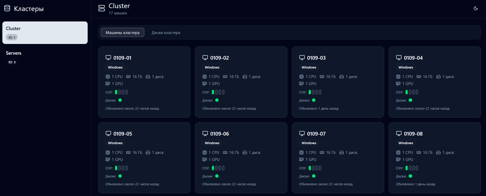
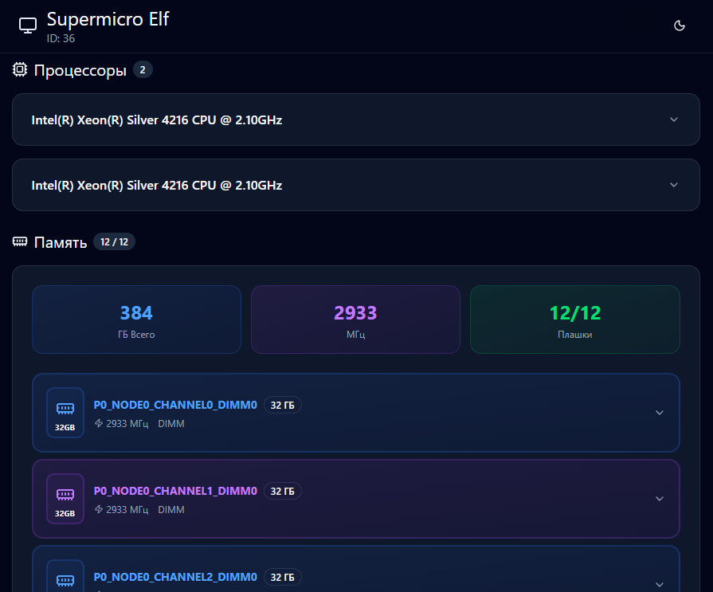
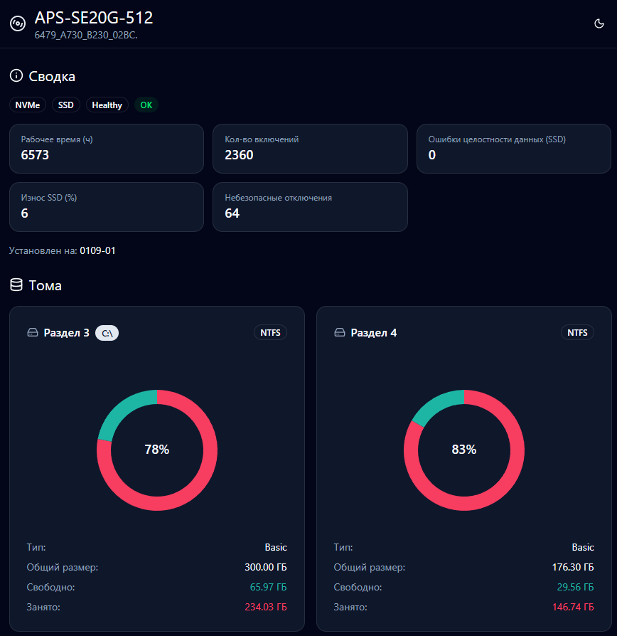

<br />
<div align="center">

  <h2 align="center"> Computer Lab Monitoring System</h2>

  <p align="center">
    A web application for monitoring the status and availability of computer classrooms
    <br />
  </p>
  <a>
    
  </a>
  <p align="center"><i>Cluster page</i></p>
  <br />
  <a>
    
  </a>
  <p align="center"><i>Machine Details page</i></p>
  <br />
  </p>
    <a>
    
  </a>
  <p align="center"><i>Disc page</i></p>
</div>

---

## Tech Stack

**Frontend:**

- Next.js 16
- TypeScript
- Tailwind CSS
- shadcn/ui

## Developer mode

1. Install packages

```bash
npm i
```

2. Run the development server:

```bash
npm run dev
# or
yarn dev
# or
pnpm dev
# or
bun dev
```

Open [http://localhost:3000](http://localhost:3000) with your browser to see the result.

## Production mode

1. Create .env file

```.env
NEXT_PUBLIC_API_URL=https://example.ru
```

2. Start

```
docker compose up -d --build
```
